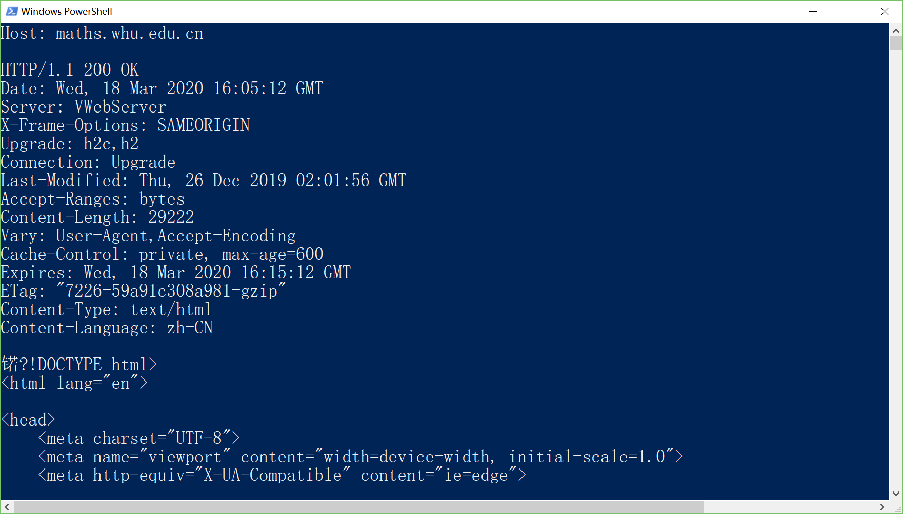
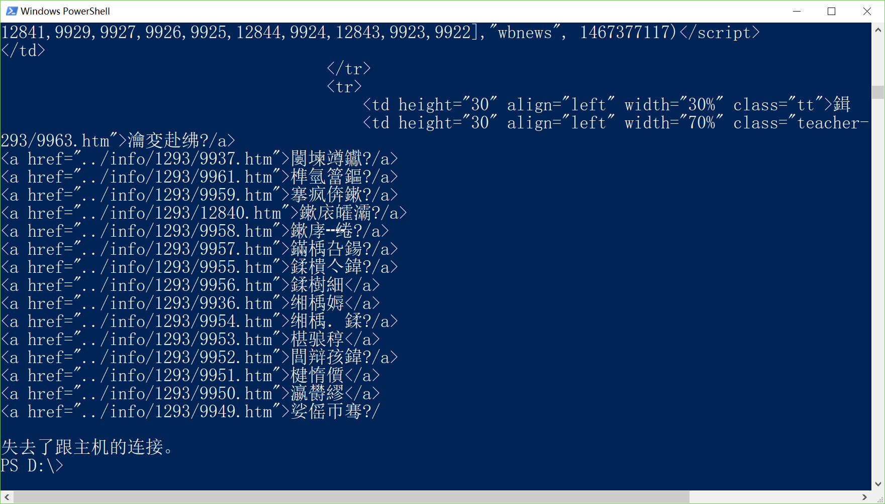
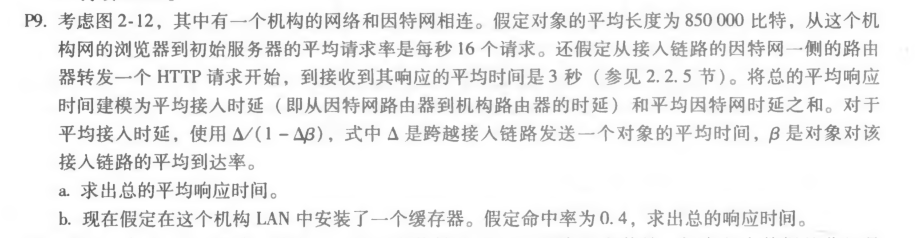
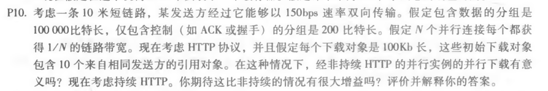

### NetworkDistribution_Homework3.

### 1.telnet whu.edu.cn 50：
##### 结果：
##### 遇到的问题：
①在小米笔记本windows启用或关闭服务选项里面，无法显示服务内容，经查询空白是注册表内容和系统冲突，修改后仍然解决不了，原因显示windows一些镜像无法自我修复。  
②放弃用系统的talnet服务，自行下载了Telnet客户端代替，自此可正常使用telnet.exe。  
③我的武大邮箱密码忘记了，经过反复试验后，由于输入密码错误次数太多，邮箱被锁了。  
****
### 2.telnet maths.whu.edu.cn 80：
##### 结果：

##### 遇到的问题：
①随意进了一个html如下，在Request Header右侧需要点击view parse变成 view source才能正确看见请求头前两行。

****
### 3.P9 题目：

##### 答案：
a.  
850000b / 15Mbps = 0.0567s ①  
16请求ps * ① = 0.9072s     ②  
t1 = ① / (1 - ②) = 0.611s   
t = t1 + t2 = 0.611s + 3s = 3.611s  
  
b.  
850000b / 15Mbps = 0.0567s  ①  
16请求ps * ① * 0.6 = 0.54432s  ②  
t1 = ① / (1 - ②) = 0.1244s  
t3 = 850000b / 100Mbps = 0.0085s  
t = (t1 + t2) * 0.6 + t3 * 0.4 = 1.87464s + 0.0034s = 1.87804s  
  
****
### 3.P10 题目：

##### 答案：
每个下载的对象都可以完全放入一个数据包中。  
让TP表示客户端和服务器之间的单向传播延迟。  
首先考虑使用非持久连接的并行下载：  
  
由题目可知，短链路长度为10米，传播时延可忽略。  
并行非持续HTTP的：  
T1 = 3*(200b/150bps) + 100000b/150bps + 3*(200b/(150bps/10)) + 100000b/(150bps/10) = 7377.3s  
持续HTTP的：  
T2 = 3*(200b/150bps) + 100000b/150bps + 10*(200b/150bps + 100000b/150bps) = 7351s  
持续性HTTP比并行非持续性HTTP并没有非常突出的优势效果。  

****
****
#### author：2017302580217_董娜
