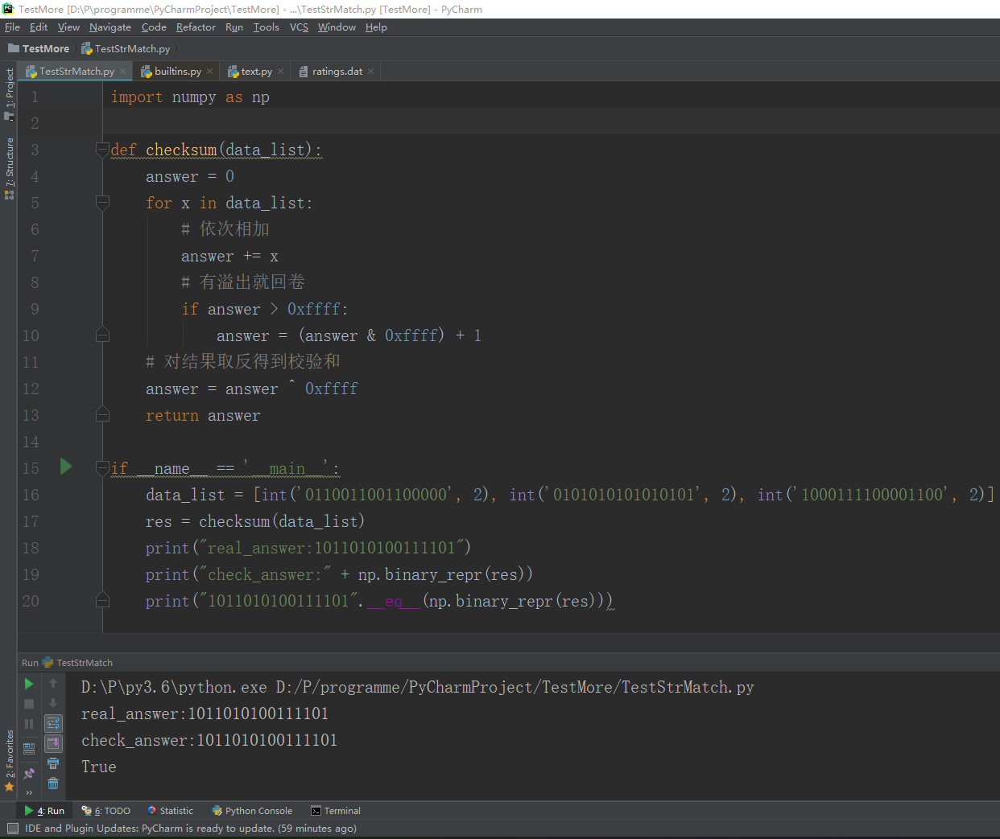
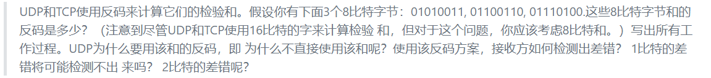
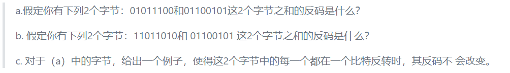

## NetworkDistribution_Homework5    
#### python实现16位UDP校验和：  
    思路很简单：    
    将每个16位转为十进制依次相加   
    若有溢出就回卷   
    对结果取反即得到了校验和    
    
   
   
#### P3：
  
   
	前两个字节相加得：01010011+01100110=10111001  
	与第三个字节相加得：10111001+01110100=100101101  
	结果反码为 011010010  
	可以知道，接收方带四个数据 (三个原始数据和校验和)  
	如果校验和包含一个零则代表出错  
	所有的一位错误都会被检测到，但是两位错误可以不被检测到  
    
#### P4：
  

	a. 01011100+01100101=11000001  
	取反：00111110  

	b. 11011010+ 01100101 =100111111  
	取反：011000000  

	c. 第一个字节为01010100；第二个字节为01101101  
	求和： 11000001

****
#### author：2017302580217_董娜
